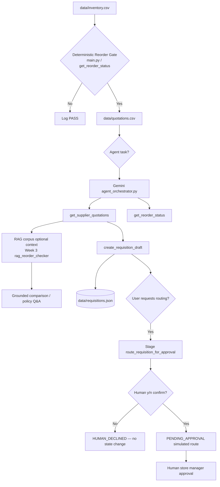

# ProcurePrep Agent Architecture (Week 4)

**Scope:** Tool calling and human-approval gate on top of the corrected SME workflow (Week 2 deterministic gate + Week 3 RAG).

**Model:** `gemini-3.5-flash-lite` with Gemini native function calling (`google-genai`, AFC disabled for manual gating).

---

## End-to-End Flow

---

## Layer Responsibilities

| Layer | Components | Role |
| :--- | :--- | :--- |
| **Operational data** | `data/inventory.csv`, `data/quotations.csv` | Stock levels and supplier quotes. |
| **Deterministic gate** | `main.py`, `src/procure_data.py`, Tool 4 `get_reorder_status` | Reorder math in Python only. |
| **RAG (Week 3)** | `src/rag_reorder_checker.py`, `knowledge/`, ChromaDB | Ground explanations in procurement corpus. |
| **Tools (Week 4)** | `src/tools.py` | Callable functions with structured I/O and deterministic validation. |
| **Orchestrator** | `src/agent_orchestrator.py` | Gemini selects tools; executes low-risk calls; gates high-impact routing. |
| **Draft store** | `src/requisition_store.py`, `data/requisitions.json` | Persists DRAFT / PENDING_APPROVAL state across calls. |
| **Human gate** | CLI confirmation | Required before `route_requisition_for_approval` executes. |

---

## Tool-calling loop

1. User provides a natural-language task (e.g. “check quotes for ITEM-004 and draft for cheapest valid quote”).
2. `generate_content` returns `function_calls` when the model chooses a tool (AFC disabled).
3. Orchestrator executes the tool via `dispatch_tool` and appends `Part.from_function_response` to the conversation.
4. Loop continues until the model returns a final text summary or `MAX_TOOL_TURNS` is reached.
5. If the model requests `route_requisition_for_approval`, execution pauses for explicit human `y/n` confirmation.

---

## Safety boundaries (Week 4 vs Week 5)

| Capability | Week 4 | Week 5 (planned) |
| :--- | :--- | :--- |
| Individual tool definitions | Yes | Extended |
| Model-initiated tool choice | Yes (single task loop) | Multi-turn autonomous loop |
| Human gate on high-impact tool | Yes | Retained |
| Full agent memory / state machine | No | Yes |

See also: `docs/architecture/rag-architecture.md` for the Week 3 retrieval layer.
