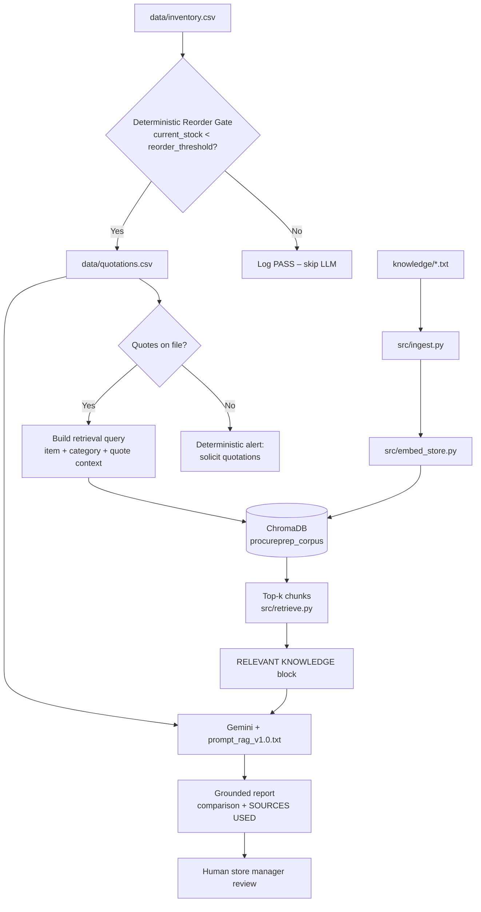

# ProcurePrep RAG Architecture (Week 3)

**Scope:** SME inventory reorder check + quotation comparison, grounded in the corrected procurement knowledge corpus.

---

## End-to-End Flow



---

## Component Responsibilities

| Layer | File(s) | Role |
| :--- | :--- | :--- |
| **Operational data** | `data/inventory.csv`, `data/quotations.csv` | Structured SME stock levels and supplier quotes (UGX, validity, delivery). |
| **Deterministic gate** | `main.py`, `src/rag_reorder_checker.py` | Reorder decision in Python only; no LLM when stock is sufficient or quotes are missing. |
| **Corpus** | `knowledge/*.txt` | 12 SME-focused policy, template, and evaluation documents (see `docs/corpus_register.md`). |
| **Ingestion** | `src/ingest.py` | Chunk plain-text corpus (400 words / 50 overlap). |
| **Embedding** | `src/embed_store.py` | Gemini embeddings → ChromaDB upsert. |
| **Retrieval** | `src/retrieve.py` | Query embedding + cosine similarity; returns ranked chunks with scores. |
| **RAG orchestration** | `src/rag_reorder_checker.py` | Retrieves chunks, injects RELEVANT KNOWLEDGE, calls Gemini, logs to `retrieval_log.txt`. |
| **Prompt** | `prompts/prompt_rag_v1.0.txt` | Grounding rules, risk flags, SOURCES USED section, policy-question mode. |
| **Output** | `results/reorder_reports_rag.md` | Markdown reports for human review. |

---

## Design Decisions

1. **Deterministic before probabilistic:** Reorder math and zero-quote handling stay in code (Week 2 pattern). RAG augments explanation, not the reorder trigger.
2. **Corpus aligned to charter:** Tender submission checklist removed; SME reorder policy and quotation evaluation criteria added.
3. **Citation contract:** Model must list `SOURCES USED` filenames; audit trail in `retrieval_log.txt`.
4. **No agents yet (Week 3):** Single-shot retrieve → generate; tool calling added in Week 4 (see `docs/architecture/agent-architecture.md`).

---

## ASCII Overview (simplified)

```
 inventory.csv ──► reorder check ──► quotations.csv
                         │                    │
                         │                    ▼
                         │            retrieval query
                         │                    │
 knowledge/*.txt ──► embed ──► ChromaDB ◄────┘
                                    │
                                    ▼
                          RELEVANT KNOWLEDGE + quotes
                                    │
                                    ▼
                          Gemini (prompt_rag_v1.0)
                                    │
                                    ▼
                     comparison report + SOURCES USED
                                    │
                                    ▼
                          human manager approval
```
